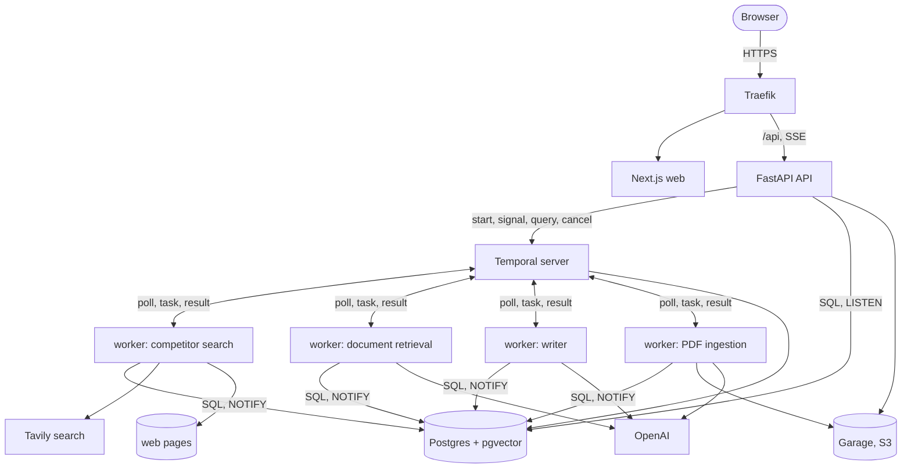

# FounderAlly

Research and first draft of a business plan for a solopreneur who has decided what to build.

## Problem

Most small-business owners never write a plan. The ones who try lack the tools for market research and competitor
analysis, and a consultant's plan costs $500 to $3,000. AI generators at $15 a month invent competitors and statistics,
and none grounds compliance in the owner's own documents. The owner ends up with nothing, or a document they cannot trust.

## What it does

From a business idea and the regulation documents the owner uploads, it produces three things: a competitor matrix from
live web search with a source link per row, a compliance checklist from the owner's documents with a page reference
per item, and a draft plan assembled from both. Every claim carries its source or says "no source". The draft stops
for the owner's review before it is saved.

## How it works

One machine, four services outside it. The browser talks to a FastAPI API. The API starts a Temporal workflow and
runs nothing long itself. Temporal hands each step to a worker polling that step's queue: one worker for the
competitor search, one for the document retrieval, one for the writer, one for PDF ingestion. Workers write every
fact to Postgres and notify; the API streams the run's events to the browser as they land. The draft waits as a
Temporal signal until the owner approves, discards or sends feedback. Nothing lives in a process: a restart loses
nothing, because every run is in Postgres and Temporal's own history.

