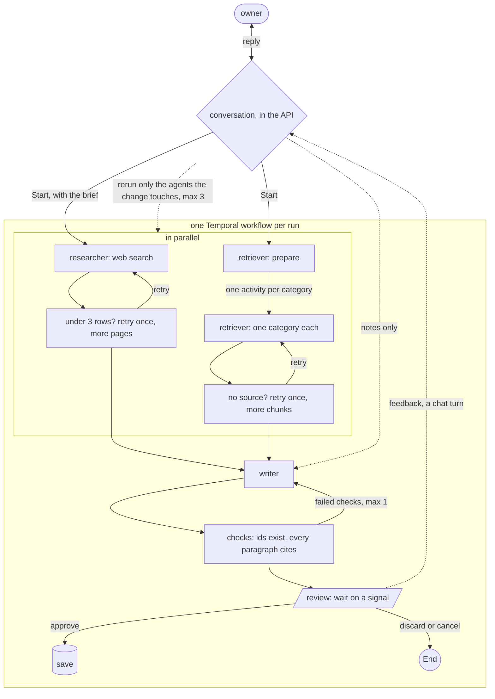

# FounderAlly

Research and first draft of a business plan for a solopreneur who has decided what to build.

## Problem

Most small-business owners never write a plan. The ones who try lack the tools for market research and competitor
analysis, and a consultant's plan costs $500 to $3,000. AI generators at $15 a month invent competitors and statistics,
and none grounds compliance in the owner's own documents. The owner ends up with nothing, or a document they cannot trust.

## What it does

From a business idea and the regulation documents the owner uploads, it produces three things: a competitor matrix from
live web search with a source link per row, a compliance checklist from the owner's documents with a page reference
per item, and a draft plan assembled from both. Every claim carries its source or says "no source". The draft stops
for the owner's review before it is saved.

## How it works

One machine, four services outside it. The browser talks to a FastAPI API. The API starts a Temporal workflow and
runs nothing long itself. Temporal hands each step to a worker polling that step's queue: one worker for the
competitor search, one for the document retrieval, one for the writer, one for PDF ingestion. Workers write every
fact to Postgres and notify; the API streams the run's events to the browser as they land. The draft waits as a
Temporal signal until the owner approves, discards or sends feedback. Nothing lives in a process: a restart loses
nothing, because every run is in Postgres and Temporal's own history.

## The run

A conversation comes first, in the API: it answers questions about the idea, asks the few that improve the first
run, names the regulation documents to bring, and proposes a brief. On Start, one Temporal workflow runs three
agents: the researcher searches the web for competitors and the retriever searches the owner's documents, in
parallel; the writer assembles both. Code, not a model, checks every row and quote and retries a thin result once.
The only pause is the review: the workflow waits on a signal until the owner approves, discards or sends feedback.
Feedback is a chat turn; code maps the changed fields to the agents that read them and reruns only those.

## Why Temporal, why LangGraph

Two layers, each for what it is good at.

**LangGraph gives the graph**: one schema per agent that every code check hangs on, the retriever run once per
category at the same time in one line, and a named step per agent in the trace. Plain functions lost on those
three; CrewAI and the OpenAI Agents SDK on the first.

**Temporal gives the three durable things**: the review waits for days with no process alive; after a crash the run
continues from the last finished step, on another worker, without repeating a paid call; a stop or a decision reaches
the run as a signal whenever it arrives. Before Temporal these came from LangGraph's checkpointer plus Celery, a
Redis key and a boot sweep we wrote ourselves. Temporal replaced three pieces of our code with one server. And it
scales by machine: each agent is a worker on its own queue, so a slow step gets more workers, on one box with
Compose today and as one Deployment per queue on Kubernetes later, with no change to the code.

**What it costs**: workflow code must be deterministic, so every call to the world is an activity; every activity
saves its rows under a key and returns ids, so a rerun reads back what is unchanged; the LangGraph plugin is in
preview, so it is pinned and hand-written wrappers are the fallback.
